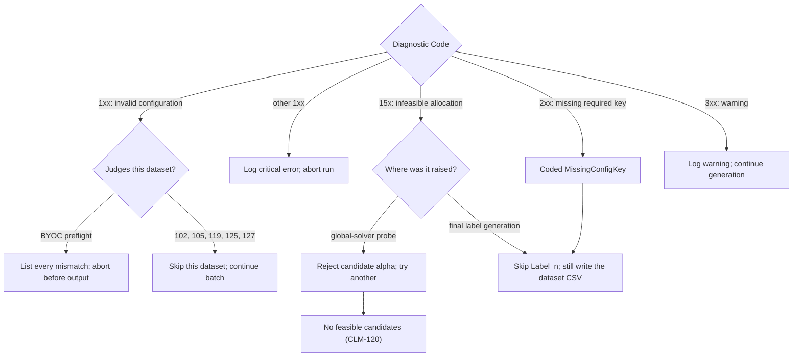

# Troubleshooting and Diagnostic Catalogue

A core requirement of *CLMSynth* package is to completely cover all configuration outcomes,
which means the program either generates correct labels based on the provided configuration, 
or it fails to produce the requested labels, and explains clearly why it failed.

To this end, a diagnostic and troubleshooting keyed catalogue accompanies the program,
every failure is explained in the troubleshooting manual (an attachment to user manual),
and a full catalogue of all error codes are generated on each main release.

The goal is to correctly identify and mitigate configuration errors, and at the same time, 
debug the program for possible cases where failure is unknown and can be patched.

The table below is a high level overview of some of the test codes and how there are organized:

| Step                                  | Errors                                           | Warnings      |
|---------------------------------------|--------------------------------------------------|---------------|
| Setup and label totals                | 106, 107, 121, 125, 126, 127, 131                | 301           |
| Matching rules                        | 101, 102, 103, 104, 105                          | 302           |
| Target-metric configuration and solve | 111, 112, 113, 114, 115, 120, 122, 123, 124, 130 | 303, 306      |
| Missing required key                  | 201, 202, 203, 204, 205, 206, 207, 208, 209      | —             |
| Exact pair target                     | —                                                | 307, 308, 310 |
| Allocation                            | 108, 150, 151, 153                               | —             |
| Competing noise                       | 116, 117, 118, 119, 152                          | 304, 305      |
| Spillover and placement               | 109, 110, 128, 129                               | 304           |
| Delivered global target check         | —                                                | 309           |

The flow diagram of the high level overview is represented below:

