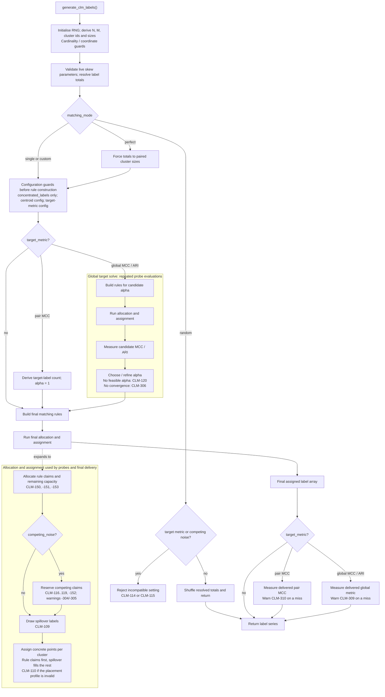

## Purpose

`clm_label_engine.py` takes a dataset that already has cluster ids
`c(x) in {clusters}` (ground truth or algorithm output, it does not matter
which) plus, optionally, the point coordinates `X`, and produces a second label
`L(x) in {0,...,M-1}` whose statistical and geometric relationship to `c(x)` is
fully specified by a `clm_label` config rather than measured after the fact.

The engine is a set of pure functions: one
top-level entry point, `generate_clm_labels(cluster_labels, coords, cfg, seed)`,
composes the stages below and returns a `pandas.Series` of length `N`, values in
`{0,...,M-1}`. Everything is deterministic under `seed`.

## Top-level flow: `generate_clm_labels`

```
rng          = default_rng(seed)
M = cfg.num_classes; assert 1 <= M <= MAX_CARDINALITY (64)  # [CLM-126]
cluster_ids  = sorted unique of c(x);  K = len(cluster_ids)
assert K <= MAX_CARDINALITY (64)                             # [CLM-127]
cluster_sizes[k] = |{x : c(x)=k}|
m_counts     = resolve_label_counts(cfg, N, rng)          # Stage 1
if perfect:  m_counts = cluster sizes (requires M==K)     # Stage 2
if random:   return draw-from-p, shuffled (early return)  # Stage 2
validate spillover concentrated_labels [CLM-128], centroid favors [CLM-129],
    and target_metric (incl. scope==pair guards [CLM-123/124/130])
if target_metric:                                         # Stage 7
    if scope==pair: m_counts = _pair_label_counts(...); alpha = 1  # 7a exact, single mode
    else:           alpha    = solve_alpha_for_target_metric(...)  # 7b numerical, global
    rules = build_rules(override=alpha)
else:               rules = build_rules(cfg, cluster_ids) # Stage 2
out = run_allocation_pipeline(...)                        # Stages 3-6
```

## Cardinality guard (`MAX_CARDINALITY`, [CLM-126]/[CLM-127])

Before any other work, `num_classes` (M) and the dataset's own cluster count (K,
derived from `c(x)`, not configured) are each checked against a fixed cap of 64.
This is a coarse safety backstop against runaway/typo configs, not a validated
statistical-significance boundary, internal testing already finds CLM results
unreliable well below this ceiling (K above ~15, M above ~20); computing a real
per-dataset significance limit is future work (a dedicated module, or manual
guidance), not something this guard attempts. The check lives once, at this
top-level entry point, the same place as the `_ensure_coords` geometry guard;
lower-level helpers like `resolve_label_counts` remain uncapped when called
directly. As a side effect, `num_classes=0` now fails here with a coded error
instead of the unguarded `1/M` `ZeroDivisionError` it used to hit inside
`resolve_label_counts`.

## Stage 1: Label totals (`resolve_label_counts`, `_skewed_proportions`, `_largest_remainder_counts`)

Produces the exact integer count `m_l` of each label over all `N` points,
`sum m_l = N`.

- `balance: balanced` -> uniform `1/M`; any explicit `proportions` are ignored
  (warns `[CLM-301]`).
- `balance: unbalanced` -> explicit `proportions` take precedence (must have
  exactly `M` entries, else `[CLM-121]`, and sum to 1, else `[CLM-106]`);
  otherwise `skew_rule` is the fallback:
  `geometric` (`p_i ~ ratio^i`), `dominant_minority` (one dominant class, uniform
  rest), or `dirichlet` (one seeded `Dirichlet(alpha)` draw, reproducible).
  Unknown rule -> `[CLM-107]`.
- Float proportions become exact integer counts by the **largest-remainder**
  method (floor each `p_l*N`, hand the leftover units to the largest fractional
  remainders), avoiding the drift of independent per-class rounding.

## Stage 2: Matching mode → rule list (`build_rules`, `_check_pair`)

Every mode is normalized to a uniform list of `Rule(label, clusters, recall_target)`.

- **`perfect`**: requires `M == K` (`[CLM-102]`); one rule per cluster at recall
  `1`. Label counts are forced to the paired cluster sizes, so
  `proportions/balance/skew_rule` are ignored (warns `[CLM-302]`), and the result
  recovers `c(x)` exactly (MCC = 1). Incompatible with `target_metric` (`[CLM-111]`).
- **`single`**: requires `M >= 2, K >= 2` (`[CLM-103]`) and a
  `single_match: {cluster k*, label l*}`. Semantics are **budget-into-`k*`**:
  `round(recall * m_{l*})` points of `l*` are placed inside `k*` (default recall
  `1`), so every `l*`-labeled point lies in `k*`; feasibility needs
  `|k*| >= round(recall * m_{l*})`.
- **`random`**: `L(x)` drawn from the resolved proportions, independent of
  `c(x)`; returns early (no allocation/placement). Rejects `target_metric`
  (`[CLM-114]`) and `competing_noise` (`[CLM-115]`).
- **`custom`**: one `Rule` per `assignment_matrix` row: route a
  `recall_target` fraction of one label's budget into a chosen set of clusters
  (surjective, partial, overlapping alignments allowed).

`_check_pair` validates every rule up front: `label in 0..M-1` (`[CLM-104]`) and
each referenced cluster exists (`[CLM-105]`), failing fast before any numpy
IndexError/KeyError.

## Stage 3: Allocation + feasibility (`allocate`, `_split_row_allocation`)

Each rule claims `tp = round(recall_target * m_label)` points of its label,
split across its clusters (`split_rule: proportional_to_size | equal`; a single
cluster short-circuits). Three feasibility checks raise `InfeasibleAllocationError`:
per-rule demand exceeds the rule's cluster capacity (`[CLM-150]`), several rules on
the same label jointly claim more than that label's budget (`[CLM-153]`, since each
rule's `recall_target` is a fraction of the label's WHOLE budget, so repeats add
up), or rules jointly oversubscribe a cluster (`[CLM-151]`). Output:
`demand[k][label]` and the `remaining_capacity[k]` of every cluster.

## Stage 4: Optional structured competing noise (`_competing_demand`)

If `competing_noise` is present, each entry converts `share` of ONE cluster's
**unclaimed** points into one specific competing label, to be placed
core/boundary/random. It deliberately bypasses the target proportions (warns
`[CLM-304]`; a warned no-op with no leftover, `[CLM-305]`). Validates
cluster/label/share/favors (`[CLM-116..119]`) and joint capacity (`[CLM-152]`).

## Stage 5: Spillover (`_spillover_draws`)

Fills the capacity left unclaimed by Stages 3-4:
`proportional_to_marginal` restores each label to its Stage-1 target count
exactly; `uniform` spreads leftovers evenly (breaks proportions);
`concentrated` dumps them into `concentrated_labels` (default: the largest
label). Unknown rule -> `[CLM-109]`. `_spillover_draws` reads `M` from the config,
not from `len(m_counts)` (deriving it from the counts array is what let a too-long
`proportions` widen the label space; see `[CLM-121]`), and `concentrated_labels` is
validated up front by `_validate_spillover_cfg` (`[CLM-128]`: a list of integer ids
in `0..M-1`; a bare number would otherwise be read by numpy as a *range*).

Breaking the proportions is no longer silent: after allocation,
`generate_clm_labels` compares the delivered counts against the Stage-1 targets
and warns `[CLM-304]` when `uniform`/`concentrated` moved them. The same code
Stage 4 raises, because it is the same statement, the label marginal has stopped
being binding; `cause` names which setting did it. Checked against the achieved
counts rather than predicted from the config, so a rule set that leaves no
leftover capacity (nothing for the rule to fill) stays quiet.

## Stage 6: Spatial placement (`assign_points_in_cluster`, `_weighted_pick`)

Within each cluster the demanded labels are assigned to specific points, then the
spillover pool fills the rest. With `centroid_dependence` enabled, *which* points
receive each label is drawn by weighted sampling without replacement, weights
from a profile of the distance to the cluster centroid (`linear`, `exponential`
with `steepness`, or deterministic top-`tp` `step`), favouring `core` or
`boundary` (validated exact and case-sensitive up front by `_validate_centroid_cfg`,
`[CLM-129]`, so a `Core` typo cannot silently invert the placement); unknown
profile -> `[CLM-110]`. `competing_noise` labels are placed first, with their own
per-label core/boundary sign (`favors_overrides`).

**Key invariant:** placement operates strictly after allocation. The
cluster--label contingency table, and therefore MCC and ARI, is fixed by
Stages 1-5, so spatial structure can be varied (core vs. boundary vs. random)
while MCC/ARI stay identical. This orthogonality is combinatorial, not geometric:
it holds even for non-convex clusters whose centroid is meaningless.

## Stage 7: Target-metric solving

Set only under `single`/`custom` (validated by `_validate_target_metric_cfg`:
mode, `type in {mcc, ari}`, `value in [-1,1]`, `scope in {pair, global}`, and, for
`scope: pair`, `type: mcc` + `single` mode + an up-front `_check_pair` of the
`single_match` cluster/label so a bad id raises `[CLM-104]`/`[CLM-105]` rather
than a raw KeyError/IndexError, plus `[CLM-130]`, which rejects any
`spillover_rule`/`competing_noise` that could place `l*` outside `k*`: `uniform`
spillover, `concentrated` onto `l*` (or its unset default), or a `competing_noise`
entry emitting `l*`). All three top-level validators (`_validate_spillover_cfg`,
`_validate_centroid_cfg`, `_validate_target_metric_cfg`) run before any solve, so a
bad config surfaces as itself rather than as a solved score over an invalid
labeling. Two paths:

### Stage 7a: exact single-pair MCC (`_pair_label_counts`, `scope: pair`)

For `scope: pair` (`single` mode, `type: mcc`) the target is the 2x2 MCC of the
`single_match` `(k*, l*)` pair, which inverts in **closed form**, no search.
Placing *all* of label `l*` inside cluster `k*` (recall 1, so no leftover spills
back in) makes the pair phi `= sqrt(m_c (N - n_k) / (n_k (N - m_c)))`; inverting
for the label size gives `m_c* = phi^2 n_k N / (N - n_k(1 - phi^2))`. The engine
resizes `l*` to `m_c*` (warns `[CLM-308]`, overriding its proportion), rescales
the other labels to keep `sum(m_counts) == N` (uniform fallback when they were all
zero), and sets `alpha = 1`. The reachable range is `[phi_min, 1]` (`phi_min` at
`m_c = 1`); a target outside it is clamped to the nearest reachable value with
`[CLM-307]`. The closed form is exact only while every `l*` point stays inside
`k*`; `[CLM-130]` (Stage 7 above) rejects the settings that could break that up
front, and after generation `[CLM-310]` re-measures the delivered pair MCC and
warns if it still landed outside tolerance (the counterpart of `[CLM-309]` for the
global solver; the message reports how many `l*` points ended up outside `k*`).

### Stage 7b: global metric (`solve_alpha_for_target_metric`, `scope: global`, default)

For `scope: global` (default; `mcc` or `ari`, `single`/`custom`), one global
recall level `alpha` is substituted into every rule and solved numerically, there
is no closed form for the global multiclass metric. A coarse grid scan brackets
the target (guarding against non-monotonicity of the achieved metric) and bisection
refines it; all probes share a fixed seed (common random numbers), so differences
reflect `alpha`, not noise. Feasibility is monotone in `alpha` by construction. If
the request exceeds the geometry's **structural ceiling**, the solver returns its
closest feasible value with a `[CLM-306]` non-convergence warning rather than
crashing or fabricating a hit (`[CLM-120]` if *no* `alpha` is feasible at all). For
`K` equal clusters the ceiling of a balanced `M`-coarsening is
`sqrt(M(M-1)/(K(K-1)))`; in general it is the MCC the rule set achieves at
`alpha = 1`. Because the probe stream (`default_rng(probe_seed)`) differs from the
output stream (`default_rng(seed)`), a solution that converged internally can still
deliver a labeling outside tolerance; the engine re-measures the labeling it
actually writes and warns `[CLM-309]` when it does, the achieved value being
authoritative rather than the request (most visible at small `N`, where spillover
placement is a large share of the outcome).


## Config schema

```yaml
global_settings:
  data_source: "clustbench"        # clustbench | mdcgen | fabricated_data | byoc
  output_dir: "OUTPUT"             # base folder for the timestamped run folders

clustbench_suite:                  # key must be "{data_source}_suite"
  batteries: ["sipu"]               # "all" or a list
  datasets: ["unbalance"]           # "all" or a list
  seed: 42                          # only used by mdcgen/fabricated_data; ignored by clustbench

label_generation:
  n_labels: 1                       # produces Label_0, Label_1, ...
  source_labeling: "labels0"        # which ground-truth labeling to key CLM math off
  noise: 0.15                       # fallback only, if clm_label is omitted
  seed: 42

  clm_label:
    # 1. CARDINALITY & BALANCE ------------------------------------------------
    num_classes: 3                  # M, the number of labels (1-64; see Known limitations)
    balance: "unbalanced"           # balanced -> uniform 1/M (proportions ignored, warns)
                                     # unbalanced -> proportions below, else skew_rule
    proportions: [0.5, 0.3, 0.2]    # used directly when balance == "unbalanced"
    skew_rule: "geometric"          # fallback when unbalanced AND no proportions given:
                                     #   geometric          p_i ~ ratio^i
                                     #   dominant_minority  one dominant class, uniform rest
                                     #   dirichlet          Dirichlet(alpha), drawn once per seed
    skew_params: {ratio: 0.5, dominant_index: 0, dominant_share: 0.6, alpha: 1.0}

    # 2. MATCHING MODE --------------------------------------------------------
    matching_mode: "custom"         # perfect | single | random | custom
    single_match: {cluster: 4, label: 0}       # required if matching_mode == single
    assignment_matrix:                          # required if matching_mode == custom
      - {label: 0, clusters: [1, 2], recall_target: 0.8}
      - {label: 1, clusters: [3],    recall_target: 0.5}
      - {label: 2, clusters: [3],    recall_target: 0.3}

    # 3. ALLOCATION -----------------------------------------------------------
    split_rule: "proportional_to_size"          # proportional_to_size | equal
    spillover_rule: "proportional_to_marginal"  # proportional_to_marginal | uniform | concentrated
                                     # NOTE: only proportional_to_marginal makes the achieved
                                     # label counts honor 'proportions'. uniform spreads leftover
                                     # points evenly; concentrated dumps them into one label.

    # 4. STRUCTURED COMPETING NOISE (optional; single/custom only) ------------
    competing_noise:
      - {cluster: 1, label: 2, share: 1.0, favors: "boundary"}
                                     # converts `share` of ONE cluster's UNCLAIMED
                                     # (leftover) points into a specific competing
                                     # label, placed at that cluster's boundary/
                                     # core/random. Withdrawn from the leftover pool
                                     # BEFORE spillover_rule above fills the rest.
                                     # Deliberately bypasses 'proportions' (like
                                     # uniform/concentrated) and changes the achieved
                                     # MCC/ARI; that structured-vs-random contrast
                                     # is its point.

    # 5. TARGET METRIC (optional; single/custom only) -------------------------
    target_metric: {type: "mcc", value: 0.6, tolerance: 0.01, max_iter: 40}
                                     # solves one global recall level so the achieved
                                     # mcc/ari meets 'value'; recall_target may be omitted
                                     # from the rules when this is present.
                                     # scope (mcc only): "global" (default) targets the
                                     # whole-partition multiclass MCC by numerical search;
                                     # "pair" (single mode only) targets the 2x2 MCC of the
                                     # single_match cluster/label and is solved exactly and
                                     # instantly, sizing that label to sit inside its cluster.
    # target_metric: {type: "mcc", scope: "pair", value: 0.6}   # exact single-pair MCC

    # 6. SPATIAL PLACEMENT (optional) -----------------------------------------
    centroid_dependence:
      enabled: true
      profile: "linear"             # linear | exponential | step
      favors: "core"                # core | boundary
      steepness: 3.0                # exponential only
```

## Project layout

| File                                   | Role                                                                                                                                                                                                         |
|----------------------------------------|--------------------------------------------------------------------------------------------------------------------------------------------------------------------------------------------------------------|
| `src/clmsynth/main.py`                 | Entry point, defaults to `test_data_config.yaml`.                                                                                                                                                            |
| `src/clmsynth/dataset_sources.py`      | Online data sources: `clustbench` (Gagolewski benchmark downloads), `mdcgen` (synthetic, via `mdcgenpy`). For the two offline data sources see below.                                                        |
| `src/clmsynth/fabricated_generator.py` | Feature generator with perfect-separation labels, used by the `fabricated_data` source.                                                                                                                      |
| `src/clmsynth/byoc_source.py`          | Bring-your-own-clusters: imports user-provided CSV, with optional min-max standardization on import.                                                                                                         |
| `src/clmsynth/label_context.py`        | `DatasetContext`, holds features, every ground-truth labeling, and every generated label.                                                                                                                    |
| `src/clmsynth/label_generator.py`      | Orchestrates label generation: calls the CLM engine per `n_labels`, or falls back to simple noise-flipping if no `clm_label` config is given.                                                                |
| `src/clmsynth/clm_label_engine.py`     | The CLM label-assignment: proportions/skew, matching modes, recall targets, allocation, spillover, competing noise, spatial placement, and the global target-metric solver.                                  |
| `src/clmsynth/clm_errors.py`           | Diagnostics: message templates keyed by a `[CLM-###]` code (1xx `ValueError`, 15x `InfeasibleAllocationError`, 3xx warnings) plus helpers.                                                                   |
| `src/clmsynth/metrics.py`              | Three standalone measures: `clustering_mcc` (Hungarian-matched multiclass MCC / Gorodkin R_K), `clustering_mcc_pair` (the quantity `target_metric.scope: pair`), and `clustering_ari` (adjusted Rand index). |
| `src/clmsynth/visualization.py`        | Scatter-plot, annotated with measured MCC/ARI and the generating config.                                                                                                                                     |
| `src/clmsynth/config_template.py`      | The YAML template string used to render a config.                                                                                                                                                            |
| `src/clmsynth/generate_config.py`      | Renders `config_template.py` into a runnable config YAML from an upstream payload file (default `upstream_payload.yaml`).                                                                                    |
| `upstream_payload.yaml`                | Example upstream payload: the minimal facts `generate_config.py` renders into the full config.                                                                                                               |
| `src/clmsynth/config_wizard.py`        | Interactive CLI wizard: asks and explains every option, then writes a config YAML.                                                                                                                           |
| `src/clmsynth/questions.py`            | The wizard's `Question`s per prompt (wording, help, default, range, `visible_when`), read by `config_wizard.py`.                                                                                             |


- The global solver builds rules, runs allocation **and assignment**, then
  measures the candidate labeling on every probe. It is shown as a loop-shaped
  subgraph rather than every grid and bisection iteration.
- Spillover is an application stage after allocation (and, when configured,
  competing-noise reservation). The early `concentrated_labels` check is only a
  narrow configuration guard; it is not spillover itself.
- The engine checks a requested metric only after the final label array has
  been assigned. Pipeline reporting is separate again: it measures written
  labels after the CSV is saved.




## Diagnostics (`clm_errors.py`)

Every raise/warning above carries a stable `[CLM-###]` code from a single
registry: `1xx` config `ValueError`, `15x` `InfeasibleAllocationError` (a
`ValueError` subclass, caught by the solver as "try another alpha" and by
`main.py` to skip a dataset), `3xx` warnings. Missing required config keys
surface as raw Python `KeyError`s `2xx` in
`troubleshooting.tex`).

## What it does *not* do

It does not synthesize features or cluster geometry (only fabricates features based on distribution rules if user intends),
`c(x)` and `X` are fixed inputs from upstream (a benchmark suite, MDCGen, an offline generator, or the
user's own CSV). It only decides which label each point gets.
